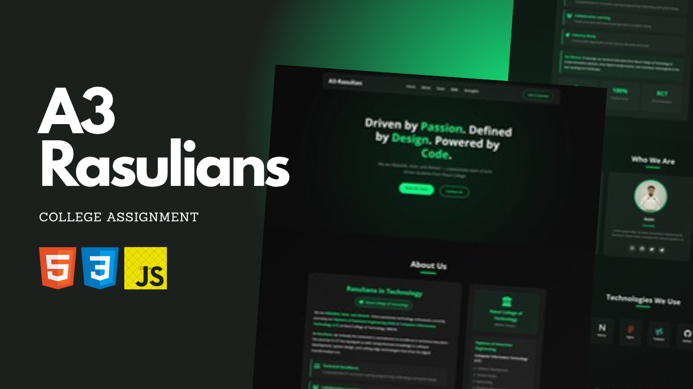

# 🌐 A3-Rasulians Portfolio  

A3-Rasulians Portfolio is a **modern and responsive team portfolio** created using **HTML, CSS, and JavaScript**.  
It showcases each team member’s role and contribution in a clean, elegant design with attention to UI consistency and responsiveness.  

Developed as part of a **college project at Rasul College of Technology, M.B.Din**, the goal was to learn teamwork, structure a real-world web project, and turn a simple concept into a polished outcome.

---

## ✨ Features
- Responsive layout for all devices  
- Modern glassmorphism-inspired design  
- Team member cards with social media integration  
- Lightweight code with zero frameworks  
- Easy to update and customize  

---

## 🧠 Tech Stack
- **HTML5** – structure and layout  
- **CSS3** – styling, grids, responsiveness  
- **JavaScript (ES6)** – interactivity and DOM control  

---

## 🎯 Objective
To practice **team collaboration**, implement **real-world web design**, and deliver a visually balanced portfolio that demonstrates both creativity and structure.  
This project blends **academic learning** with **practical development experience**.

---

## 💡 Reflection
> “Every small project builds the foundation for something greater.”  
This portfolio reflects the mindset of **building, learning, and executing ideas professionally** — even as students.

---

## 🧑‍💻 Developed By
**Team A3 – Rasulians**  
Department of Computer Information Technology  
**Rasulian 024**  

---

⭐ *Give the repo a star if you liked it or found it inspiring!*  
